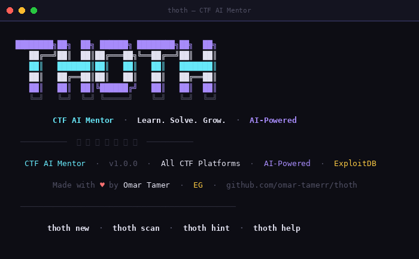
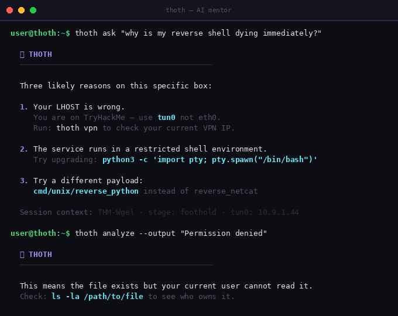
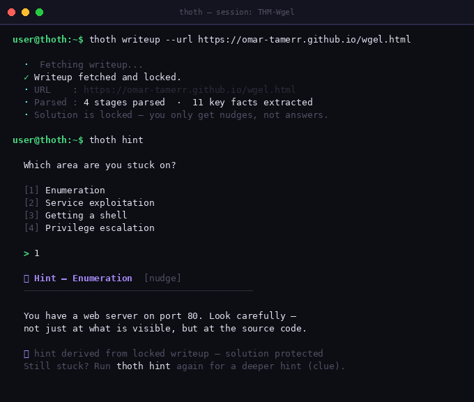
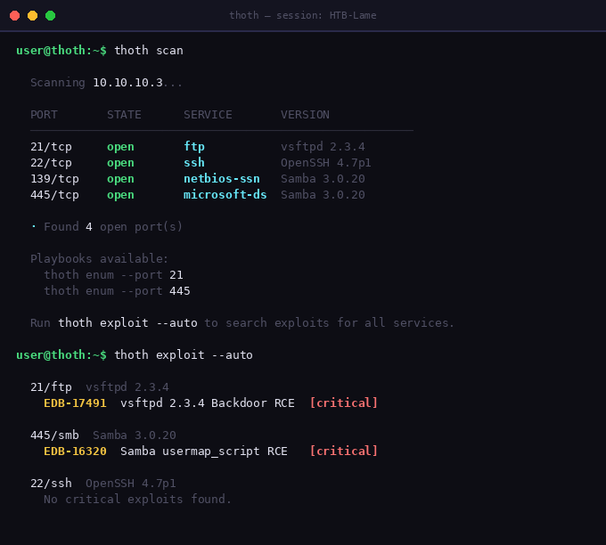
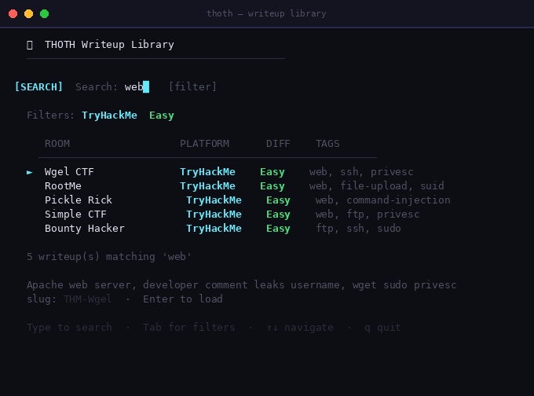
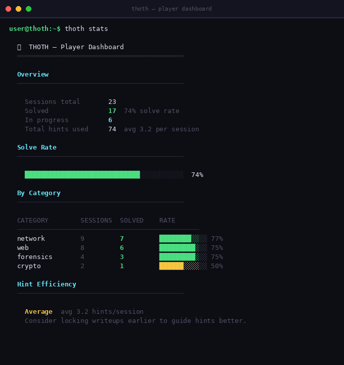

<div align="center">

```
 ████████╗██╗  ██╗ ██████╗ ████████╗██╗  ██╗
    ██╔══╝██║  ██║██╔═══██╗╚══██╔══╝██║  ██║
    ██║   ███████║██║   ██║   ██║   ███████║
    ██║   ██╔══██║██║   ██║   ██║   ██╔══██║
    ██║   ██║  ██║╚██████╔╝   ██║   ██║  ██║
    ╚═╝   ╚═╝  ╚═╝ ╚═════╝    ╚═╝   ╚═╝  ╚═╝
```

**CTF AI Mentor · Learn. Solve. Grow.**

[](https://python.org)
[](https://kali.org)
[](LICENSE)
[](https://github.com/omar-tamerr)
[-purple?style=flat-square)](https://console.groq.com)

*The open-source CLI tool that guides you through CTF challenges with AI — without spoiling the answer.*

[**Install**](#-installation) · [**Features**](#-features) · [**Writeup Collaboration**](#-writeup-collaboration) · [**Commands**](#-command-reference)

</div>

<div align="center">



</div>

---

## What is THOTH?

THOTH is a **terminal-based CTF mentor** powered by free AI. It sits next to you while you hack — scanning ports, suggesting tools, giving progressive hints, and learning your style over time.

The core philosophy is simple: **teach, don't tell.**

When you're stuck, THOTH doesn't hand you the answer. It asks what you've tried, points you in the right direction, and escalates only when you ask for more. Every hint is earned.

---

## Two Killer Features

### 1. AI That Knows Your Challenge

THOTH's AI isn't generic ChatGPT. Every response is injected with your full session context — your target IP, what ports are open, what tools you've tried, how long you've been stuck, and what stage you're at.

```
$ thoth ask "why is my reverse shell dying immediately?"

THOTH: Three likely reasons on this box:
  1. Your LHOST is wrong — use tun0 not eth0
     Run: thoth vpn to check your IP
  2. The service runs in a restricted shell environment
  3. Try a different payload: cmd/unix/reverse_python
     instead of reverse_netcat
```

This is not a generic answer. THOTH knows you're on TryHackMe, knows your tun0 IP, knows you've been on foothold for 25 minutes. The AI adapts to you — not the other way around.

**AI commands:**





```bash
thoth hint                          # progressive hint — nudge → clue → near-solution
thoth ask "why is X not working"    # free-form AI chat about your challenge
thoth analyze --output "error msg"  # paste any error, AI explains it
thoth rabbit                        # AI detects if you are in a rabbit hole
thoth review                        # post-solve AI performance review
thoth mindset                       # stuck? get a direct redirect
thoth script "scan all ports then check vulns"  # generate shell scripts from English
thoth tools                         # context-aware tool suggestions
thoth explain CVE-2007-2447         # deep explanation tied to your challenge
```

---

### 2. Writeup Intelligence — Hints Without Spoilers

This is the feature that makes THOTH different from everything else.

**The problem:** You're stuck. You open a writeup. You accidentally read too far. The challenge is ruined.

**THOTH's solution:** Lock the writeup URL. THOTH fetches it, parses it silently into stages, and extracts the key steps. You never see the writeup — but your hints come directly from it.

```
$ thoth writeup --url https://your-writeup-url.com/room

  ✓ Writeup fetched and locked.
  · 4 stages parsed · 9 key facts extracted
  · Solution is protected — you only get nudges

$ thoth hint
  Which area are you stuck on?
  [1] Enumeration  [2] Exploitation  [3] Getting a shell  [4] PrivEsc

  > 1
  𓂀 Hint — Enumeration  [nudge]
  ──────────────────────────────
  Have you checked what's on port 80 carefully?
  Not just what's running — what's inside it.

$ thoth hint         ← run again for deeper hint
  𓂀 Hint — Enumeration  [clue]
  ──────────────────────────────
  The Apache default page has been modified.
  Look at the HTML source — there is something hidden there.
```

Three levels. Every time you ask for a hint, it gets more specific.




 The full solution is never shown unless you unlock it yourself. **You learn. You don't just copy.**





---

## Features

<table>
<tr>
<td width="50%">

**Session Management**
- Named sessions — resume anytime
- Full activity log per session
- Export sessions as JSON
- Never lose your progress

**Smart Scanning**
- nmap integration with auto-loaded playbooks
- 20+ service playbooks (FTP, SSH, SMB, MySQL, Redis...)
- Each playbook has default creds, CVEs, and exact commands
- Ranked attack paths from scan results
- ASCII mind map of target

**ExploitDB Integration**
- Search by text, CVE ID, or EDB number
- Auto-search all services after scan
- Works offline with searchsploit
- Online fallback to exploit-db.com

</td>
<td width="50%">

**Writeup Library**
- Built-in library with curated writeups
- Browse with interactive arrow-key menu
- Live fuzzy search as you type
- Filter by platform, difficulty, category
- Paste a THM/HTB URL — THOTH finds the writeup
- Session name auto-detection
- 10 results per page

**Gamification**
- 🔥 Daily solving streak tracker
- ⚡ Achievement badges (Pure Solve, Speed Demon, Veteran...)
- Room difficulty rating system
- Shareable session summary cards
- Public leaderboard stats

**Quality of Life**
- Auto VPN IP detection (tun0/tun1)
- Network pivoting guide (chisel, socat, SSH, ligolo-ng)
- Encoding decoder (Base64, hex, ROT13, morse, JWT, binary)
- Auto-generate Markdown writeup from session
- Player skill profile built from hint history

</td>
</tr>
</table>





---

## Installation

```bash
# Clone the repo
git clone https://github.com/Omar-tamerr/Thoth
cd thoth

# Install (adds 'thoth' command globally)
chmod +x install.sh
./install.sh

# Or run directly
python3 thoth.py
```

**Requirements:**
- Python 3.8+ (zero external pip packages)
- nmap (for scanning): `sudo apt install nmap`
- searchsploit (optional): `sudo apt install exploitdb`

**Set up free AI (takes 2 minutes):**

```bash
# 1. Get a free key at https://console.groq.com (no credit card)
# 2. Set it:
thoth config groq_api_key gsk_your_key_here
# 3. Done — all AI features are now active
```





---

## Quick Start

```bash
# 1. Start a session for your room
thoth new
  > Session name: THM-Wgel
  > Target IP:    10.10.10.3
  > Platform:     TryHackMe
  > Category:     web

# 2. Scan the target
thoth scan

# 3. Load a writeup (optional but powerful)
thoth writeup --url https://your-writeup.com

# 4. Get hints when stuck
thoth hint

# 5. Submit your flag
thoth flag THM{your_flag_here}
```

---

## Writeup Library

```bash
thoth library                    # browse with arrow keys
thoth library --search "web"     # search by keyword
thoth library --load wgel        # fuzzy load by name
thoth library --url https://tryhackme.com/room/wgelctf  # paste room URL
thoth library --update           # fetch latest writeups from GitHub
```

**What the library looks like:**

```
  𓂀  THOTH Writeup Library
  ─────────────────────────────────────────────────────────
  Type to search  ·  Tab for filters  ·  ↑↓ navigate  ·  q quit

     ROOM                   PLATFORM      DIFF    TAGS
    ─────────────────────────────────────────────────────────
  ► Wgel CTF               TryHackMe     Easy    web, ssh
    RootMe                 TryHackMe     Easy    web, upload
    Lame                   HackTheBox    Easy    smb, samba
    Blue                   HackTheBox    Easy    windows, smb
    ...

  Apache web server, hidden SSH key, wget sudo exploitation
  slug: THM-Wgel  ·  Enter to load
```

---

## Writeup Collaboration

THOTH's hint engine works by loading structured writeups — not raw blog posts. Each writeup is a JSON file with progressive hints at 3 levels per stage.

**If you write CTF writeups and want yours in the THOTH library, I would love to collaborate.**

> ⚠️ **Important:** Only writeups that have been given explicit permission by their author are included in the library. No writeup is added without direct agreement from the creator.

### How collaboration works:

1. You write a room writeup (blog, Medium, GitHub — anywhere)
2. We agree on terms — your name stays on every hint your writeup generates
3. I convert it to THOTH format and add it to the library
4. Every THOTH user who solves that room sees your name

### What you get:

- Your name attributed in every hint delivered from your writeup
- Exposure to the entire THOTH user base
- Your writeup URL linked in the library
- A contributor badge in the repo

### Contact:

Open an issue on [thoth-writeups](https://github.com/omar-tamerr/thoth-writeups) or reach out directly.

---

## Command Reference

```bash
# Session
thoth new                      # create session
thoth sessions                 # list all sessions
thoth resume <name>            # resume session
thoth delete <name>            # delete session
thoth export <name>            # export as JSON

# Scanning
thoth scan                     # smart nmap + auto-playbooks
thoth scan --ai                # scan + AI interpretation
thoth enum --port 445          # service playbook
thoth paths                    # ranked attack paths
thoth map                      # ASCII target map
thoth cheat --category web     # category cheatsheet

# ExploitDB
thoth exploit --search "vsftpd 2.3.4"
thoth exploit --cve CVE-2007-2447
thoth exploit --id 16320
thoth exploit --auto           # auto-search all services

# Guidance (AI)
thoth hint                     # progressive hint by area
thoth writeup --url <url>      # lock + parse writeup
thoth writeup --generate       # auto-generate your writeup
thoth tools                    # context-aware suggestions
thoth explain <topic>          # deep explanation
thoth decode aGVsbG8=          # auto-detect encoding

# AI Commands
thoth ask "question"           # free-form AI chat
thoth analyze --output "..."   # AI reads command output
thoth rabbit                   # rabbit hole detection
thoth review                   # post-solve AI review
thoth mindset                  # frustration redirect
thoth script "task"            # generate shell scripts

# Notes
thoth note "found anon FTP"    # save note
thoth notes                    # view all notes
thoth log                      # full activity log
thoth flag THM{...}            # submit flag

# Progress
thoth progress                 # session stage timeline
thoth stats                    # full dashboard
thoth profile                  # skill map
thoth streak                   # solving streak
thoth badges                   # achievement badges
thoth rate 4                   # rate the room

# Library
thoth library                  # interactive browser
thoth library --search web     # search
thoth library --load wgel      # fuzzy load
thoth library --url <url>      # load by room URL
thoth library --update         # fetch latest

# Network & Utils
thoth pivot                    # pivoting guide (chisel, socat, SSH)
thoth pivot chisel             # specific technique
thoth vpn                      # show VPN IP (tun0)
thoth share                    # shareable session card
thoth leaderboard --share      # share stats publicly

# Config
thoth config                   # view settings
thoth config groq_api_key gsk_ # set AI key
thoth setup                    # first-run wizard
thoth help                     # full help
```

---

## File Structure

```
thoth/
├── thoth.py                   # entry point + CLI router
├── install.sh                 # global install script
├── requirements.txt           # zero pip dependencies
├── core/
│   ├── ai.py                  # Groq API client (free AI)
│   ├── banner.py              # ASCII banner
│   ├── colors.py              # ANSI terminal colors
│   ├── config.py              # settings management
│   ├── db.py                  # SQLite — sessions, notes, logs
│   ├── session.py             # session CRUD
│   └── writeup_engine.py      # fetch + parse + stage writeups
├── commands/
│   ├── scan.py                # thoth scan
│   ├── hint.py                # thoth hint (AI + writeup)
│   ├── exploit.py             # thoth exploit (ExploitDB)
│   ├── library.py             # thoth library (interactive)
│   ├── pivot.py               # thoth pivot (tunneling)
│   ├── gamify.py              # badges, streak, share, vpn
│   ├── decode.py              # thoth decode
│   ├── enum_cmd.py            # thoth enum, paths, cheat
│   ├── notes.py               # thoth note, log, flag
│   ├── progress.py            # thoth stats, profile, map
│   ├── tools.py               # thoth tools, explain, writeup
│   └── ai_cmds.py             # thoth ask, rabbit, review...
└── data/
    └── playbooks/             # 20+ service knowledge modules
        └── __init__.py        # FTP, SSH, SMB, MySQL, Redis...
```

**Where your data lives:**
```
~/.thoth/thoth.db              # SQLite — all sessions, notes, profile
~/.thoth/library/              # cached writeup library
~/thoth-writeups/              # generated writeups (.md)
~/thoth-exports/               # exported sessions (.json)
```

---

## Platforms Supported

| Platform | Status |
|---|---|
| TryHackMe | ✓ Full support |
| HackTheBox | ✓ Full support |
| PicoCTF | ✓ Full support |
| VulnHub | ✓ Full support |
| CTFTime | ✓ Full support |
| Any CTF | ✓ Platform-agnostic |

---

## Tech Stack

- **Language:** Python 3.8+ — zero external pip dependencies
- **AI:** Groq API (free) — LLaMA 3.3 70B
- **Database:** SQLite via stdlib `sqlite3`
- **HTTP:** stdlib `urllib` only
- **Terminal UI:** stdlib `termios` + ANSI codes

---

<div align="center">

**Made with ♥ by Omar Tamer · EG**

[GitHub](https://github.com/omar-tamerr) · [writeups repo](https://github.com/omar-tamerr/thoth-writeups)

*If THOTH helped you solve a room, give it a ⭐ — it helps more people find it.*

</div>
